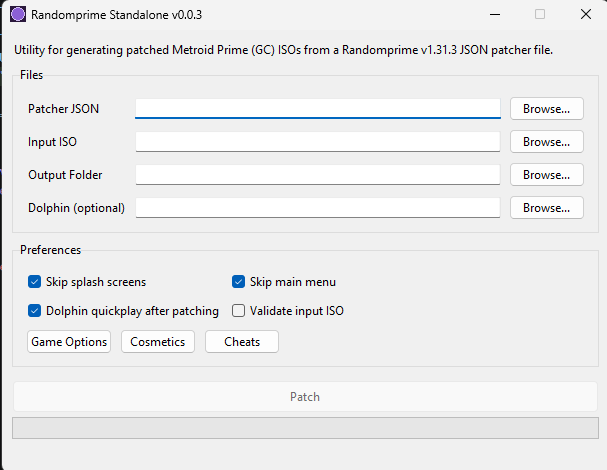

# Randomprime Standalone App



Desktop app that applies a [Randomprime](https://github.com/randovania/randomprime) patcher JSON (for example, one exported by [Randovania](https://randovania.org/)) to a vanilla Metroid Prime ISO.

Configuration persists between app runs.

## Usage

Download the archive for your OS from [Releases](../../releases) and extract it. On Windows, run the exe. On Linux/macOS, mark it executable first (`chmod +x`).

## Development

***Do NOT read past this line unless you are a contributor.***

On Windows, run this once to install Git bash and GNU make and add bash to your PATH:

```powershell
./tools/install-bash.ps1
```

On Linux/macOS, confirm `make` is installed (it usually is).

| Command | Description |
| ------- | ----------- |
| `make run` | Run the app from source |
| `make test` | Run unit tests (`test/`) |
| `make lint` | Check formatting, lint, and types |
| `make format` | Auto-format and fix lint |
| `make upgrade` | Upgrade locked dependencies |
| `make release` | Build the standalone executable into `build/dist/` |
| `make publish` | Build and publish the PyPI package (CI only) |
| `make clean` | Delete the venv and build outputs |

## Releasing

Dispatch the `Release` workflow from the GitHub Actions tab.
